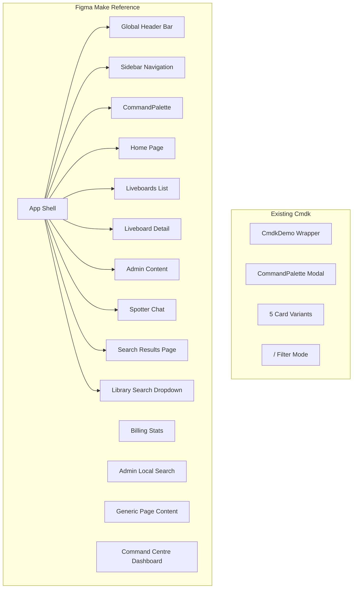

# Cmdk vs Figma Make: Gap Analysis and Migration Plan

## Architecture Comparison

The two projects have fundamentally different scopes:

### Existing Cmdk Prototype (`src/prototypes/Cmdk/`)
- **Scope**: Standalone command palette modal with a demo wrapper
- **Stack**: React + inline styles using Radiant design tokens
- **Structure**: Modal-only — opens over a dark preview area
- **Files**: `CommandPalette.tsx`, `CmdkDemo.tsx`, 5 ResultCard variants, types, mock data
- **Key features**: "/" filter mode, context-aware filter ranking, 5 card UI variants, keyboard shortcuts

### Figma Make Reference (`src/prototypes/Cmdk/Cmd(figmamake)/`)
- **Scope**: Full ThoughtSpot application shell with integrated command palette
- **Stack**: React + Tailwind CSS + lucide-react icons + recharts
- **Structure**: Complete app with sidebar, header, routing, content pages
- **Files**: ~30 components including App, Sidebar, CommandPalette, plus 15+ content pages
- **Key features**: Everything in the existing prototype PLUS a full app shell around it

---

## Feature-by-Feature Comparison

### 1. Command Palette Modal

| Aspect | Existing Cmdk | Figma Make | Gap |
|---|---|---|---|
| Dimensions | 624x540px | 754px wide, 540px tall | Width difference |
| Search input | "/" filter mode with filter chips | "/" filter mode with reorderable chips | Similar |
| Filter chips | 8 types (Radiant icons) | 9 types (Lucide + custom SVG icons) | Need: Spotter chip |
| Result cards | 5 variants (figmaSpec, compact, spacious, twoLine16, twoLine20) | Single variant with context/author inline | Figma Make is simpler but more functional |
| Default view | Groups: Recent, Suggested, Quick links | Groups: Recent, Create, Quick links | Need: Create group |
| Admin commands | ~15 basic navigate commands | ~100+ admin commands covering ALL admin pages with tab-level navigation | Major gap |
| Object search | Basic text search on small dataset | Search across Liveboards, Answers, Collections, Data Models, Tables, Connections | Major gap |
| "View all" action | Not present | Shows "View all objects for query" and "View search in spotter" | Need to add |
| Spotter integration | Not present | Cmd+Enter sends query to Spotter, suggestion cards for Spotter | Need to add |
| Context-aware chips | Reorder by page context | Reorder by app tab (admin, data, etc.) | Similar concept, different implementation |
| Keyboard shortcuts | Up/Down, Enter, Escape, "/" | Up/Down, Enter, Escape, "/", Tab autocomplete, Cmd+Enter (Spotter), Shift+Enter (new tab), Backspace (remove chip) | Need: Tab, Cmd+Enter, Shift+Enter |
| Toast notifications | Not present | Shows toast on navigation | Need to add |
| Text highlighting | Not present | Highlights matching query text in results | Need to add |
| Initial filter | Not present | Can open with pre-selected filter (e.g., from sidebar search icon) | Need to add |

### 2. Application Shell (NOT in existing prototype)

These are entirely new components that the Figma Make project has:

- **Global Header Bar** (`App.tsx` lines 97-218): Dark (#1D232F) 60px header with TS logo, search bar (click opens Command Palette), help icon, notification bell with badge, user profile dropdown with org name
- **Left Sidebar** (`Sidebar.tsx`): 261px wide, dark theme, 4-tab switcher (Insights/Data/Develop/Admin), categorized navigation items, scope toggles (All Orgs/Primary Org), highlighted page animation, admin search integration

**UPDATE (Feb 2026):** GlobalHeader, AppSidebar, and AppShell have been extracted as reusable Radiant widgets under `src/components/`. They are registered in the component registry and visible in the Radiant preview site. They still need to be wired into the Cmdk prototype.

### 3. Content Pages (NOT in existing prototype)

- **Home** (`Home.tsx`): Watchlist cards grid + Recently Viewed table
- **Liveboards** (`Liveboards.tsx`): Liveboard list with tabs (All/Yours), search, bulk selection, table view
- **Liveboard Detail** (`LiveboardDetail.tsx`): Full-page liveboard with charts (recharts), fullscreen mode with hamburger sidebar toggle
- **Admin Content** (`AdminContent.tsx`): Tab-based admin pages with 11 page categories
- **Command Centre** (`CommandCentre.tsx`): Resource control dashboard with status cards
- **Billing Stats** (`BillingStats.tsx`): Billing dashboard with tabs
- **Spotter** (`Spotter.tsx`): AI chat interface with simulated responses
- **Search Results** (`SearchResultsPage.tsx`): Full search results page with left sidebar filters (object type, tag, author), sort, result cards with tags

### 4. Search Variants (3 global options in Figma Make)

The Figma Make project supports 3 interaction models via `globalOption`:
- **Option 1**: Command Palette (Cmd+K) — standard modal
- **Option 2**: Command Palette + Admin search icon in sidebar opens palette with admin filter pre-selected
- **Option 3**: Library search dropdown in header + Admin local search — no command palette, uses inline search instead

### 5. Data Layer

| Aspect | Existing Cmdk | Figma Make |
|---|---|---|
| Mock data file | `data/mockData.ts` — ~15 items, 8 filter options, context rankings | `data/mockData.ts` — 10 Liveboards, 7 Answers, 5 Collections, 5 Data Models, 8 Tables, 6 Connections (41 total objects) |
| Object types | answer, liveboard, admin, spotter, help, navigate, create | Liveboard, Answer, Collection, Data Model, Table, Connection |
| Object metadata | label, description, context, rightLabel, icon, group | name, type, author, avatar, modified, tags, description, views, favorites, type-specific fields |
| Admin commands | Not in data file | 100+ commands covering all admin pages/tabs |

---

## Prioritized Migration Plan

### Phase 1: Upgrade Command Palette Core (High Impact)

- Expand admin commands data from ~15 to 100+ (match `ADMIN_COMMANDS` in Figma Make's `CommandPalette.tsx`)
- Add rich mock data (41 objects with full metadata from Figma Make's `mockData.ts`)
- Add "Create" group items (Spotter chat, Answer, Liveboard, Connection, Collection)
- Add "Quick links" group (Admin settings, Profile, Community, Developer Docs)
- Add text highlight matching in results
- Add Tab autocomplete, Cmd+Enter (Spotter), Shift+Enter (new tab) keyboard shortcuts
- Add toast notification on navigation
- Add "View all objects" and "Ask Spotter" special result items when query active
- Support `initialFilter` prop for pre-selecting a filter chip

### Phase 2: Build Application Shell (Medium-High Impact)

- ~~Build global header bar (dark, 60px, logo, search bar trigger, help/notification/profile)~~ DONE — GlobalHeader widget
- ~~Build left sidebar with 4-tab switcher (Insights/Data/Develop/Admin)~~ DONE — AppSidebar widget
- ~~Compose header + sidebar into reusable shell~~ DONE — AppShell widget
- Wire AppShell into Cmdk prototype with actual content routing
- Connect scope toggle (All Orgs / Primary Org) to sidebar state
- Connect page highlight animation from Command Palette navigation

### Phase 3: Build Content Pages (Medium Impact)

- Home page (Watchlist + Recently Viewed)
- Liveboards list page (table with search, tabs, bulk select)
- Liveboard detail page (with chart visualizations)
- Search Results page (with sidebar filters)
- Admin content pages (tabbed layout for all admin sections)
- Resource Control Centre dashboard
- Billing Stats page
- Spotter chat page
- Generic page content placeholder for Data/Develop sections

### Phase 4: Additional Search Variants (Lower Priority)

- Library Search Dropdown (Option 3)
- Admin Local Search (Option 3)
- Global option switcher for comparing the 3 search patterns

---

## Key Decision: Styling Approach

The existing Cmdk uses **Radiant design tokens + inline styles** (the project standard). The Figma Make uses **Tailwind CSS**. The migration converts Figma Make's Tailwind classes to Radiant design tokens — either CSS Modules (for global widgets like GlobalHeader/AppSidebar/AppShell) or inline styles (for prototype-level code).

## Source Files Reference

### Existing Cmdk
- `src/prototypes/Cmdk/index.tsx` — exports
- `src/prototypes/Cmdk/CmdkDemo.tsx` — demo wrapper with variant/context dropdowns
- `src/prototypes/Cmdk/CommandPalette.tsx` — main modal (624x540px)
- `src/prototypes/Cmdk/types.ts` — type definitions
- `src/prototypes/Cmdk/styles.ts` — shared styles
- `src/prototypes/Cmdk/components/` — CommandSearch, ResultCard variants, FilterChip, FilterOptions, KeyboardShortcuts
- `src/prototypes/Cmdk/data/mockData.ts` — ~15 items, 8 filters

### Figma Make Reference
- `src/prototypes/Cmdk/Cmd(figmamake)/src/app/App.tsx` — main app (~417 lines)
- `src/prototypes/Cmdk/Cmd(figmamake)/src/app/components/Sidebar.tsx` — sidebar (~661 lines)
- `src/prototypes/Cmdk/Cmd(figmamake)/src/app/components/CommandPalette.tsx` — palette (~829 lines)
- `src/prototypes/Cmdk/Cmd(figmamake)/src/app/data/mockData.ts` — rich data (~569 lines)
- Content pages: Home, Liveboards, LiveboardDetail, AdminContent, CommandCentre, BillingStats, Spotter, SearchResultsPage, GenericPageContent, LibrarySearchDropdown, AdminLocalSearch

### Global Widgets (extracted from Figma Make, now in Radiant)
- `src/components/GlobalHeader/` — GlobalHeader.tsx + GlobalHeader.module.css + index.ts
- `src/components/AppSidebar/` — AppSidebar.tsx + AppSidebar.module.css + index.ts
- `src/components/AppShell/` — AppShell.tsx + AppShell.module.css + index.ts
