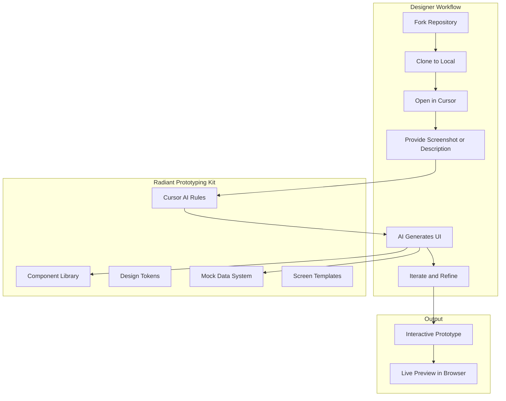

# ThoughtSpot Radiant Prototyping Playground

## Vision Summary

Create a **fork-ready starter kit** where designers:

1. Fork the repository
2. Open in Cursor
3. Describe/screenshot their UI idea
4. AI generates interactive prototypes using Radiant components
5. Each designer works in their own fork, can contribute back

## Recommended Approach: Enhance figmaradiant

After analyzing both projects:

- **figmaradiant** (current): 11 components, clean architecture, Vite/CSS Modules, excellent Cursor rules
- **radiant-code**: 60+ components, Storybook, SCSS, more complex dependencies

**Recommendation**: Use figmaradiant as the base and selectively port needed components from radiant-code. This gives you:

- Simpler onboarding for designers
- Already optimized for AI-assisted development
- Lighter weight, faster to fork and run
- Full control over the codebase

## Architecture




## Implementation Plan

### Phase 1: Foundation Setup

**1.1 Create Prototypes Directory Structure**

```
src/
  prototypes/              # NEW - Designer workspace
    _template/             # Empty starter template
      index.tsx
      README.md
    _examples/             # Reference examples
      FilterDialog.tsx
      DataDashboard.tsx
      SettingsPanel.tsx
```

**1.2 Enhance Cursor Rules for Screenshot-to-UI**

Add a new rule: `.cursor/rules/prototype-generation.md`

- Instructions for interpreting screenshots
- How to identify Radiant components from visuals
- Mock data generation patterns
- Layout composition guidelines

**1.3 Create Mock Data System**

```
src/mocks/
  users.ts                 # Sample user profiles
  analytics.ts             # Chart/table data
  navigation.ts            # Menu structures
  forms.ts                 # Form field options
  index.ts                 # Central export
```

### Phase 2: Expand Component Coverage

**Components to port from radiant-code** (priority order):

| Priority | Component | Reason |

|----------|-----------|--------|

| High | Select/Dropdown | Essential for forms |

| High | Table | Core for analytics UI |

| High | Tooltip | Contextual help |

| High | Popover | Actions/menus |

| Medium | DatePicker | Common in filters |

| Medium | Pagination | Table navigation |

| Medium | Avatar | User representation |

| Medium | Card | Content containers |

| Low | Accordion | Collapsible sections |

| Low | Stepper | Multi-step flows |

This brings total to ~20 components - sufficient for most prototypes.

### Phase 3: Onboarding Experience

**3.1 Landing Page for Designers**

Modify `src/pages/HomePage.tsx` or create `src/pages/WelcomePage.tsx`:

- Welcome message
- Quick start instructions
- Link to create new prototype
- Gallery of example prototypes

**3.2 New Prototype Wizard**

When designer starts, show:

```
Welcome to Radiant Prototyping!

To create a new prototype:
1. Create a new file in src/prototypes/YourProjectName.tsx
2. Describe your UI or paste a screenshot
3. I'll generate code using Radiant components

Ready? Tell me what you want to build...
```

**3.3 Getting Started Guide**

Update `getting-started/your-first-prototype.md`:

- Fork instructions
- Cursor setup
- First prototype walkthrough
- Best practices

### Phase 4: Branching and Collaboration

**4.1 Git Workflow Documentation**

```
docs/
  collaboration/
    forking-guide.md           # How to fork
    branching-strategy.md      # Feature branches
    contributing-back.md       # PR workflow
```

**4.2 Recommended Branch Structure**

```
main                           # Stable base kit
  feature/prototype-name       # Designer's work
```

**4.3 Template .gitignore**

Ensure `src/prototypes/` files (except templates) are gitignored in the base repo but tracked in forks.

### Phase 5: Developer Experience

**5.1 NPM Scripts**

```json
{
  "scripts": {
    "dev": "vite",
    "new-prototype": "node scripts/create-prototype.js",
    "preview": "vite preview",
    "build": "vite build"
  }
}
```

**5.2 Prototype Template Generator**

`scripts/create-prototype.js`:

- Prompts for prototype name
- Creates folder structure
- Opens in editor

## Key Files to Modify

| File | Change |

|------|--------|

| `[src/App.tsx](src/App.tsx)` | Add prototype routes |

| `[src/pages/HomePage.tsx](src/pages/HomePage.tsx)` | Designer onboarding UI |

| `[.cursor/rules/design-system.md](.cursor/rules/design-system.md)` | Enhance for prototyping |

| `[README.md](README.md)` | Update for prototype workflow |

| `[package.json](package.json)` | Add helper scripts |

## New Files to Create

| File | Purpose |

|------|---------|

| `.cursor/rules/prototype-generation.md` | AI rules for generating prototypes |

| `src/prototypes/_template/index.tsx` | Starter template |

| `src/mocks/index.ts` | Mock data exports |

| `docs/prototyping-guide.md` | Full designer guide |

| `scripts/create-prototype.js` | CLI helper |

## Component Porting Strategy

When porting from radiant-code:

1. Convert SCSS to CSS Modules
2. Replace any ThoughtSpot-specific dependencies
3. Adapt to figmaradiant's token system
4. Add JSDoc documentation for AI
5. Create showcase example

## Timeline Estimate

| Phase | Effort |

|-------|--------|

| Phase 1: Foundation | 2-3 days |

| Phase 2: Components | 5-7 days (2-3 components/day) |

| Phase 3: Onboarding | 1-2 days |

| Phase 4: Collaboration docs | 1 day |

| Phase 5: DX polish | 1-2 days |

**Total: ~2 weeks for MVP**

## Success Criteria

- Designer can fork, clone, and run in under 5 minutes
- AI can generate basic prototypes from text descriptions
- AI can interpret screenshots and suggest component usage
- Multiple designers can work in parallel on different forks
- Changes can be contributed back via PRs

