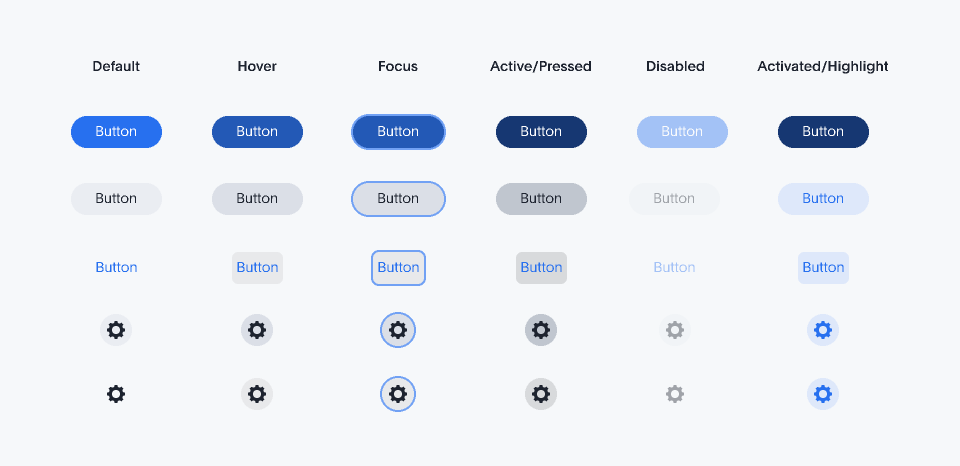
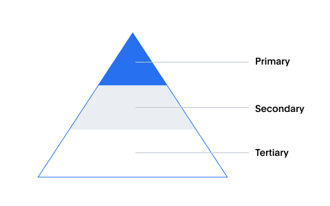
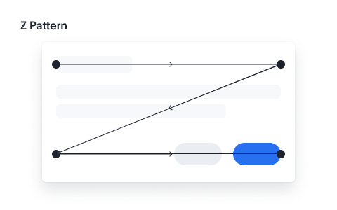
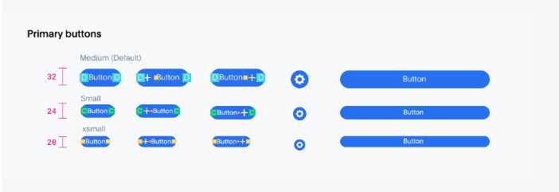
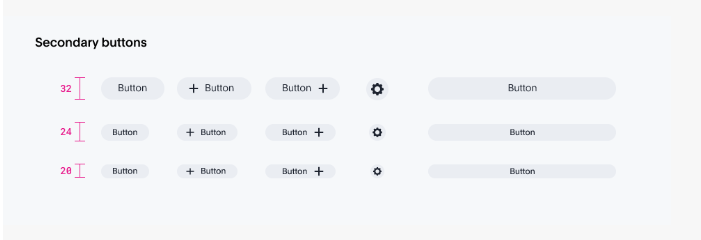
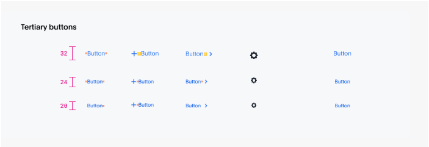
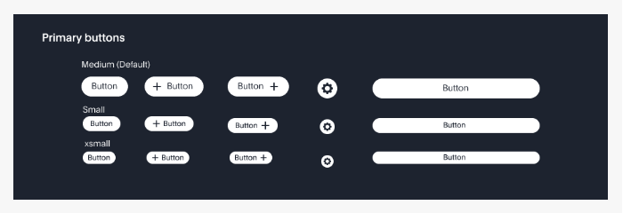
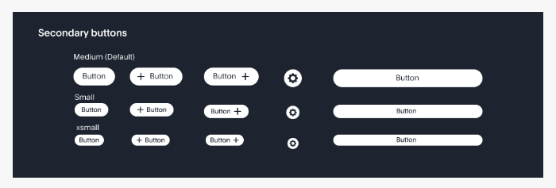
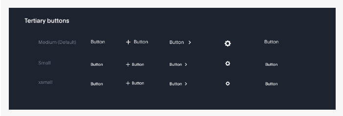
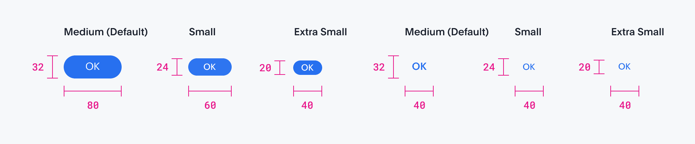

# Buttons

## **Buttons are used to initialize an action. Button labels express what action will occur when the user interacts with it.**

[Overview](Buttons%20309374cae3fa81ff9a9ee2689e7c4ade.md) 

[**Button types**](Buttons%20309374cae3fa81ff9a9ee2689e7c4ade.md) 

[**Button sizes**](Buttons%20309374cae3fa81ff9a9ee2689e7c4ade.md) 

[**Button group**](Buttons%20309374cae3fa81ff9a9ee2689e7c4ade.md) 

[**Icon buttons**](Buttons%20309374cae3fa81ff9a9ee2689e7c4ade.md) 

---

# Overview

## **Button states**

## **Hierarchy**

You don’t necessarily need to use the buttons in the order that their labels imply. For example, you don’t always need to use the secondary button as the second button in your layout. The most important thing is to establish a visual hierarchy between the buttons in your UI. Keep these best practices in mind.

**A single, high-emphasis button**

As a general rule, a layout should contain a single high-emphasis button that makes it clear that other buttons have less importance in the hierarchy. This high-emphasis button commands the most attention.

**Multiple button emphasis**

A high-emphasis button can be accompanied by medium- and low-emphasis buttons that perform less important actions. Keep in mind that you should only group together calls to action that have a relationship to one another.

Although secondary buttons have less visual prominence because they are less saturated than their primary counterparts, they are still tonally heavy. If your layout requires multiple actions—as is the case with some toolbars, data lists and dashboards—low emphasis buttons.

---

### **Alignment**

**The Z Pattern**

The Z-pattern is a natural way for the user to go through content within a constrained container and when tasks are oriented from the top-left and ending with a primary call to action on the right bottom side of the container.

Modals, spotlight card follow the Z Pattern

---

# **Button types**

**Primary**

Primary buttons trigger the main action for an entire page or a container. There can only be one primary button per page or container. It may contain text, text with an icon, or just an icon. Size options include medium, small or extra-small.

**Secondary**

Secondary buttons trigger additional or less important actions. They may accompany a primary button, or exist on their own or as part of a button tray. Just as with primary buttons, they may contain text, text with an icon, or just an icon, and may come in medium, small, or extra-small.

**Tertiary**

For less prominent, and sometimes independent, actions. Tertiary buttons can be used in isolation or paired with a primary button when there are multiple calls to action. Tertiary buttons can also be used for sub-tasks on a page where a primary button for the main and final action is present.

---

## **Dark background**

The non-default buttons for dark backgrounds can be access via the control knob on the [Radiant Storybook](https://radiant.corp.thoughtspot.com:6006/). The hierarchical and button sizing guidelines remain unchanged.

---

# **Button sizes**

**Medium (Default) 32px**

Use as primary page actions and other standalone actions.

**Small 24px**

Use when it is in a small container or there is not enough vertical space.

**Xsmall 20px**

Use when there is not enough vertical space for the small size button. (for text button, caution to use)

**Full bleed 32px (Width is based on container)**

Use when buttons bleed to the edge of a larger component.

---

## **Usage**

---

**Category**

**Size**

**Examples**

---

**Medium (Default)**

32px

---

**Small**

24px

---

**Xsmall**

20px

---

Full bleed 32px

Width is based on container

32px

---

## **Button width and truncation**

---

## **Do's and don'ts**

✅ Do

When space is available, string length dictates the button width.

❌ Don’t

Unnecessary truncation.

✅ Do

When space is constrained, wrap text to second line.

❌ Don’t

Unnecessary truncation.

---

# **Button group**

Button groups are a useful way of aligning buttons that have a relationship. Group the buttons logically into sets based on usage and importance. Too many calls to action will overwhelm and confuse users so they should be avoided.

As mentioned in the Hierarchy section, you don’t necessarily need to use the buttons in the order that their labels imply. Either a secondary or a tertiary button can be used in conjunction with a primary button.

---

# **Icon buttons**

---

## **Tooltips**

All the icon buttons should have tooltips when hover over on them.

