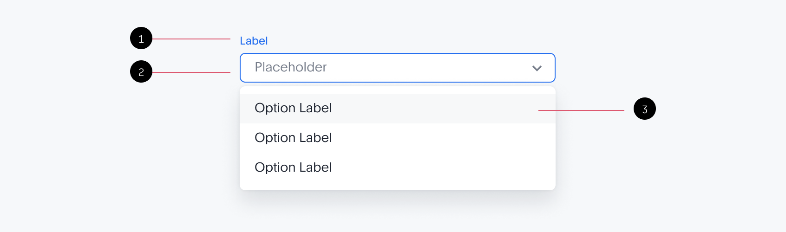

# Dropdown

## **Dropdown toggles contextual menu overlays for displaying lists.**

---

## **Definition**

Dropdown menu appears when the user clicks on a selector input field. The dropdown invites the user to select a value from several predetermined options. The input field displays the currently selected menu item above the list of options.

---

## **Formatting**

1. Optional field label
2. Dropdown input field
3. Dropdown menu (see Menus for configuration options)

---

## **Usage**

**Dropdown field width**

- Dropdown input field width is fixed and does not change with the menu content
- The menu can be wider than the dropdown input field if the content text is long
- If the content text exceeds the maximum width allowed in the menu, it is truncated with an ellipses (...)
- Maximum number of menu items visible by default: **7**

**Developer note**

> The above would be the default setting and will be applied to all the dropdowns where [**dropdownWidth**] is not explicitly passed.
> 

> However, the user can override this behavior by using either [**targetWidth**] or [**minTargetWidth**] which is supported currently.
> 

**Menu width configurations**

| Type | Description | Example |
| --- | --- | --- |
| Equal width | The width of the dropdown field equals to the menu | <insert image> |
| Content width | Dropdown's menu width is dictated by the length of the content. | “ |
| Fixed width | 240px fixed for single-select dropdowns. 320px for multi-select dropdowns with the search box. | " |

---

## **Behavior**

| Type | Description |
| --- | --- |
| Trigger  | The dropdown menu opens when the user clicks on the selector input field. |
| Exit | The dropdown menu closes when the user clicks outside the menu or chooses an item from it. In the latter case, the input field updates to display the newly selected item. |
| Positioning | The select menu always appears below the input field. |

**States**

