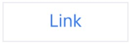

# Links

## **Links let users navigate to another location.**

---

## **Types & examples**

Links come in three colors, determined by their backgrounds.

---

Type

Usage

Example

---

Default link

Use a blue link on white or gray backgrounds.

White link

Use a white link on dark backgrounds, or where text itself is white.

Black link

Use a black link on light backgrounds, or where text itself is black.

---

## **Usage**

**Do's and don'ts**

| ✅ Do | ❌ Don’t |
| --- | --- |
| Links that fall within text should mirror that text’s font size. | Don’t use generic text like “click here.” Instead, use a meaningful descriptive label, and match the destination site’s name. |
| Links that fall within text should not include punctuation. |  |
| Links that fall on a colored background should use the default HTML text-decoration setting for that background. |  |
| Links should be named for their destinations, or for whatever event occurs when they’re clicked. Keep names concise. |  |

**Default link**

Default link in the table

**White link**

White link in the toast alert

**Black link**

Black link in the homepage

---

## **Behavior**

**States**

Links that fall within text should mirror that text’s font size.

