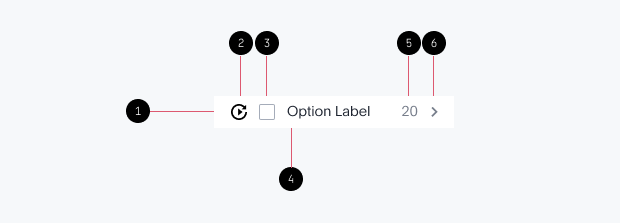

# Menus

## **Menus are a compact way to display a group of actions. An action menu is triggered when a user right-clicks, interacts with an icon, button, or other triggering element.**

---

## **Formatting**

1. Menu field at 32px
2. Menu icon (optional)
3. Checkbox / selector (optional)
4. Menu content
5. Contextual content
6. Trailer icon / drill-down indicator

1. Group header (optional)
2. Menu title
3. Contextual information / description (optional)
4. Selected state
5. Section divider (optional)

---

## **Usage**

Divide large, complex action items into logical sections for easier navigation and faster discovery.

> Avoid text truncation by keeping content concise.
> 

> Maintain the same voice and tone across all menu items.
> 

> Make all menu action words (Verbs): Download, Present, Save.
> 

> Allow users navigate menus options using keyboard keys.
> 

> Avoid wrapping the menu’s text to multiple lines.
> 

**Configurable variations**

**Menu items count**

> Maximum number of menu items visible by default: **7**
> 

> Search is not applicable for menus with items **less or equal to 7**
> 

---

## **Behavior**

| Trigger  | Menus are triggered by clicking on a button, icon, selector, or by right-clicking on a chart.  |
| --- | --- |
| Exit | Menus are closed by clicking outside the menu. |
| Positioning | Action menus are bottom and left-aligned under the triggering component by default. If the viewport lacks space to render them this way, they may be right-aligned under the component. When neither option is possible, the menu may appear to the side. |

**Menu width**

There are three ways to define the menu width: **defined by form width**, **content width** and **fixed width**.

---

Type

Description

Example

---

**Defined by form width**

Set the default width of all menus equal to form width.

---

**Defined by content width**

In the case when the menu trigger is shorter than the content length, the menu width can be defined by the content length. The max width is **240px**.

---

**Fixed width at 240px**

When a search bar applies to the menu, to avoid menu size shuffling by search results, use fixed width at **240px**.

---

F**ixed width at 320px**

When content text is expected to be long and unpredictable (e.g user-defined), use fixed width at 320px.

---

**Menu empty state**

**States**

