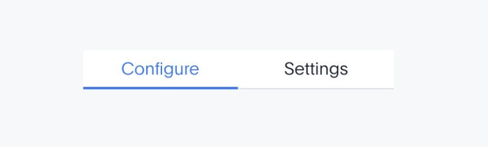

# Tabs

## **Tabs allow users to choose between different topics of content. Users can select a tab to find their way around an app. Any content under a tab must be related to the title of the tab.**

---

## **Types & examples**

Each type of navigation comes with its own specific uses, behaviors and scenarios.

---

Type

Usage

Example

---

**Small (32px)**

Use this for when you need tabs for:

Nested, space-constrained containers
Pages that need a hierarchy and has multiple sub-components
Cases where the tab bar shouldn't be as prominent. For example: pages that already contain “parent” medium tabs, or nested “accordion” sections.
Narrow containers and panels (< 30

---

**Medium (48px)**

For most use cases, this is the type of tabs you may use.

---

## **Formatting**

1. Text label for the active tab
2. This indicates that this tab is active
3. Text label for an inactive tab
4. Divider

---

## **Usage**

| ✅ Do | ❌ Don’t |
| --- | --- |
| Always use a 1px divider line at the bottom of the tab tray. | Don’t confuse tabs with segment controls. Segment controls represent a choice within a section. Tabs are choices across different sections. |
| Use padding between two tab trays in a row. | Include more than three words in one tab. |
| Text labels should clearly describe the content of the tab. | The sections that the tabs define function independently of each other, so do not use tabs to define a linear, ordered process. |
| Tab names must be consistent. If you use a noun for one tab, make sure to use a noun for other tabs. |  |
| Optimize copy to avoid truncating text. |  |
| Tab labels appear in a single row. |  |
| Use sentence case for tabs with multiple words. |  |
| Distribute small tabs evenly within their parent container. |  |

---

## **Behavior**

**Trigger**

To bring a tab’s content to the front, click on it.

**Exit**

To leave a tab, click on a different tab.

**Positioning**

Medium tab trays are always left-aligned within their containers.

Small tab trays are always center-aligned within their containers. Tabs are distributed evenly.

**State**

Depending on a user’s action, this is how the different states of tabs will look like.

### **Specifications**

To make sure you have the right specifications for your tabs, follow this guide:

