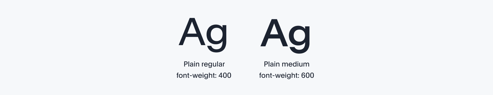

# Typography

# Table of contents

## 

---

## Radiant’s typography supports the efficient and clear presentation of design and content and also serves to express ThoughtSpot’s brand presence and content hierarchy.

# THis is a header

## **Typeface**

Radiant uses the Plain font - Plain medium and Plain regular - exclusively for the ThoughtSpot product. Italic and other special font variants are not supported.

> Note: Platforms and browsers render fonts differently and weight may differ across platforms like Figma or their design tools
> 

---

## **Type scale**

Radiant’s type scale supports the varied needs of the ThoughtSpot product, ensuring flexibility without sacrificing consistency. The type scale supports nine type sizes, with guides for the intended application and meaning of each.

> We use 400 and 600 font-weight (normal / bold) in HTML. The closest rendering equivalence in Figma would be Light (375) and Medium (600).
> 

> Use <b></b> 700 font weight to bold a certain word in a sentence.
> 

| **Category** | **Name** | **Font-weight** | **Font-size** | **Line-height** | **Letter-spacing** |
| --- | --- | --- | --- | --- | --- |
| Display | Large Headline | 600 | 32pt | 40px | -0.4px |
| Title | Page Title | 600 | 24pt | 32px | -0.4px |
| Title | Modal Title | 600 | 20pt | 28px | -0.4px |
| Label | Section Label | 600 | 18pt | 24px | 0px |
| Label | Content Label | 600 | 16pt | 24px | 0px |
| Label | Content Label Subhead | 600 | 14pt | 20px | 0px |
| Body | Body Large | 400 | 16pt | 24px | 0px |
| Body (Default) | Body Normal | 400 | 14pt | 20px | 0px |
| Footnote | Footnote & Caption | 400 | 12pt | 18px | 0px |

---

## **Type hierarchy**

Instead of defining type scale by HTML's heading tags (H1, h2, h3, etc), Radiant defines them by their assigned role in the content hierarchy to better support consistency across the product and its varied content types.

---

**Scale**

**Size**

**Description**

**Usage**

---

**Display**

32pt

Reserved for large display headlines like marketing assets, onboarding, priority announcements, and so on.

---

**Title**

24pt

20pt

Titles are top-level labels that describe large amounts of content in a screen.

---

**Label**

18pt

16pt

14pt

Labels are mini-titles for sections and subsections of content within a screen. Labels also refer to the short text used to describe functional elements like toggles, tabs, menus, buttons or other interactive elements. Learn more about content labels.

---

**Body**

16pt

14pt

Body text comes in normal size (14 pt) and Large (16pt), and is typically used for long-form writing and descriptive text. Normal text is default text size for most situations, large is typically reserved for supporting large font titles.

---

**Footnote Caption & Overline**

12pt

The smallest text size (12pt) is reserved for footnotes, caption and overline and should not be used for regular body text or labeling.

---